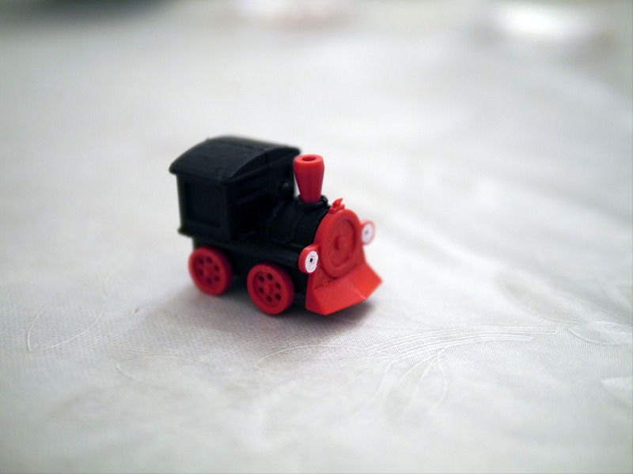

Little SL
=========

About
-----

This project originated in the wish from my son to have a little SL for his book which we got second handed. The original train was lost and the Snapmaker contest gifts for kids for kids day gave me one more reason to try out making my own version of this. The whole thing finished just in time on 2021-06-01.

This repository describes some design decisions behind it and the final print and assembly in the hope that this would inspire other hobby makers.

Design
------

I decided to design everything in [FreeCAD](https://www.freecadweb.org/). It is free, I already played around with it in other projects and it works better for creative or complex design than OpenSCAD for example. The final FreeCAD project is [included](src/LittleSLv1.FCStd) in the `src` folder.

Before drafting anything in FreeCAD I had to decide how this hole thing can be made for a 3D printer with ease to print and multiple colors. I decided to split the parts with different colors into separate parts in the design and also split the main body in two pieces that can be printed without support on the outward surface. Believing that this would give me the best result.

I found it practical from other works with FreeCAD to start the project with a spreadsheet that includes the print tolerance and main dimensions. Aliases are added to the cells to be able to reference to them in later equations/expressions.

Putting not too many parameters into the spreadsheet I have decided to scale everything to the target size and only focus on the proportions of the train. That means that every length in the design is derived from a factor of either `W_BASE`, `H_BASE` or `D_BASE` in the spreadsheet. Or other values from the spreadsheet. This ensured that everything should look more or less the same even if some dimensions were changed. This also helped me to form the final visual proportions of the train by adjusting only some values in the spreadsheet. Feel free to change that for your liking.

Starting with the cabin, the first design obstacle was the roof of the train. While it looks quite simply it was not easy to design with proper fillets. One could put the fillets later on in the `Part Design` workbench but that often turns out to break depending features if the topology changes due to the topological naming in FreeCAD. That is why I tried to avoid it where possible, at least as a step in between. But it turned out that there was a handy workbench for that task. [Curved Shapes](https://wiki.freecadweb.org/CurvedShapes_Workbench) can be installed via addon manager and provides a way to describe a shape via its projected shape on the three different planes. This can be done with the `Curved Array` tool. Due to some extrapolation one needs to cut off some small margin at the ends. I also noticed that the whole interpolation creates some mathematical rounding errors that left some gaps between the roof and the cabin. Overlapping both parts slightly helped to mitigate this issue.

Note that I tried first to solve this by making a refined part. It turned out in later operations that this seems to break the geometry in FreeCAD in some circumstances. I had to revert all `Refine` settings to be able to perform the final cut, as this needs a non-broken geometry. One can easily check if the geometry is broken with the `Check Geometry` function in the `Part` workbench.

The remaining work for the main body was rather straight forward. I only struggled a bit with the right proportions. For the cabin itself I decided to leave only some engraved windows rather than a hollow cabin to improve its structural strength. But one could change `SideWindowPocket` and `FrontWindowPocket` to cut through all to get a hollow cabin.

The chimney and pilot are designed as separate objects to allow different print colors/materials for those. I tried to make the structure in a way that would print without supports needed (given proper bridging) while keeping the final print orientation in mind (i.e. main body cut vertically in the middle and the pilot flat on).

For the top of the pilot I had to split the design into two parts joined in an additional operation. The pyramid on the top could probably also be design as a cube with pockets of the edges from two different planes but I decided to handle this as a loft in FreeCAD. This comes with the restriction that addictive lofts in the `Part Design` workbench need to have the same number of vertices which does not work well for a pyramid with a sharp tip. It is also not possible to define a rectangle in the sketcher with a 0mm edge. However, the loft operation in the `Part` workbench seems to have no such restriction. Using a rectangle sketch and a single vertex let me create a simple pyramid in the `Part` workbench.

In the final steps all that was left to be done was to cut out the cross alignment from the main body and pilot, split the main body in the middle and create a clone of all parts in the optimal print orientation. In the `Part` workbench I used the `Create a copy/Create transformed copy` operation for this. And the `Split/Slice apart` tool to get the two halves of the main body. It turned out later that the `Create a copy` do not produce a linked copy but a real copy. So any change made is not propagated to these copies. The `Part Design` tool `Clone` was the better choice here.

Note that I created two versions of the main body. One with a rail guide and one without. The book had a ~6mm diameter path engraved to make the train move only along the designated way. The printed version below also includes this guide but one may find it more varied without. Therefore, I decided to make both version. So feel free to create a free standing toy or your own rail system along with it.

In the version 2 of the train I changed the cross cutout of the main body to make it printable completely without supports and increased the radius of the axle holes of the main body to make lower the friction and make it easier to turn the wheels.

Print and Assembly
------------------

All parts are already rotated to their optimal print orientation. They can be mashed in the `Mesh Design` workspace of FreeCAD to the desired resolution and exported to STL for printing. I used Cura to slice the files at 0.08mm layer height with a 0.4mm diameter nozzle.

The layer adhesion of the used PLA filament was quite poor and strong warping effects are also observed. It seems that 3D print pen filament is not really reliable on 3D printers. But it was an affordable way to get filament in many different colors without taking much storage space. Note that the pilot was printed 45° rotated to get the optimal result on the bridged cross cutout. That means short bridging paths.

These printed quite well. The cross, however, suffered from its small surface on the print sheet and failed at around 90% height. Later, I reprinted it in black PETG with a raft.

This was the first time I used PETG. I ran into several issues with bed adhesion and finally finished the two body parts and a new alignment cross. I also used 0.08mm layer height here even though the minimum recommended height from Polymaker is 0.1mm. A higher printing temperature than 235°C may and better flow calibration may had improved the result but I was a little bit short on time.

I used two spring steel rods with 1mm diameter to align both body parts with the chimney attached. The printed axle hole tolerance was doable but involved to much friction on the axles. I used a little manual hand drill to increase the hole size by around 50%. This resulted in a way smoother turn of the wheels.

I used some [Loctite Super Glue](https://www.loctiteproducts.com/en/products/fix/super-glue/loctite_super_glueliquidprofessional.html) to put the body parts together with the assistance of the printed alignment cross. This also applied some pressure between the parts while the glue cured out. I also tried some Tangit PVC-U Plus on some printed PolyLite PETG parts to see if that works better. Also between PLA and PETG. But I found the super glue to be easier to dose and stronger in their connection even though many sources claim that hardly any glue works for PETG. It may not be as strong as PLA with PLA but worked just fine for this assembly.

I used the same glue to first glue the wheels of one side to the axle. I gave it some time to cure before proceeding to avoid getting it stuck to the body part. I had my doubt that the small surface of the axle would be enough to hold it together properly, but it turned out all right so far. In this step I also glued the pilot to the front side. Once again the cross alignment helped to put everything in the right place. Although, the warped pilot made it hard to glue properly to the rest of the body. A little bit more glue helped filling the gap in the middle. The roughness of the bridged cutout in the pilot and the printed top side of the cross helped to get a good adhesion.

I had to trim the spring steel rods to the right length. You need to be careful here when using pliers or pincers because the rods fire off quite fierce when cut them. The intended length was 27.6mm but a little bit longer than that should also work. You can get this length by comparing the wheel axle hole y coordinates of two facing wheels. 

The rods are inserted and the wheels on the other side are also glued to them carefully avoiding the glue from sticking to the body. All that is left is some color on the eyes.

The eyes were especially designed to help the color flow in the right areas. The tiny dot in the middle is sightly embossed to prevent the color from mixing. I used oil based permanent marker pens with 0.8mm diameter. I also tried some water based acrylic pens on some other printed piece but these turned out to scratch off easily from plastics. One may feel free to also add a little smile to this face.

Everything was ready to be played with :)
